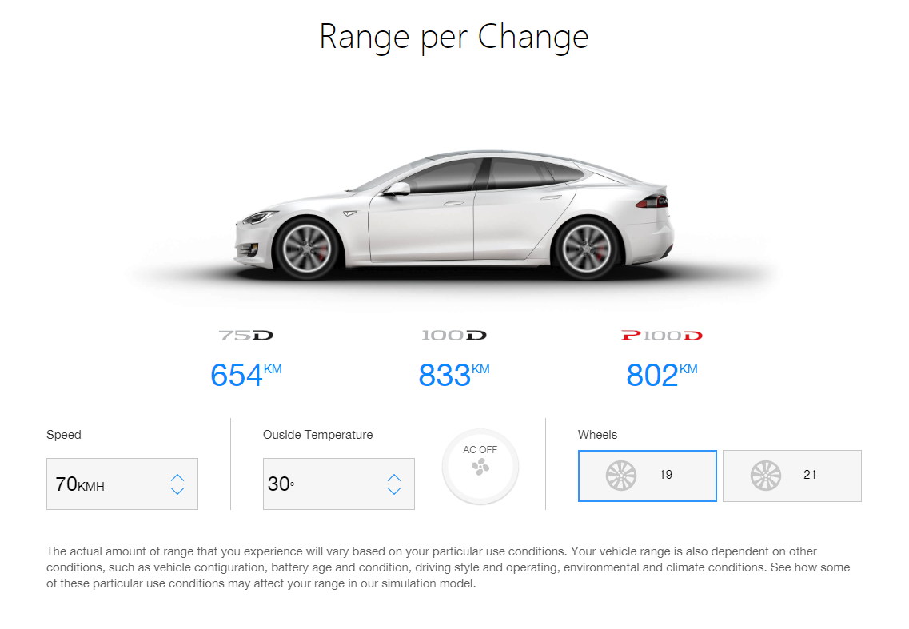

# React Tesla Range Calculator
Check out the [live demo](https://tesla-range-calculator.herokuapp.com/)

## Screenshots

## Motivation
I'd like to practice frond-end development realted skill espeacially react. So I decided to implement Tesla Range Calculator from [Tesla](https://www.tesla.com/en_AU/models) by using react and creat-react-app

## Tech/framework used
<b>Built with</b>
- [React](https://github.com/facebook/react)
- [create-react-app](https://github.com/facebook/create-react-app)

## Features
Range of different models are automatically update after user interact with the controller components:speed controller, temperature controller, ac/heat controller and wheelsize controller.

